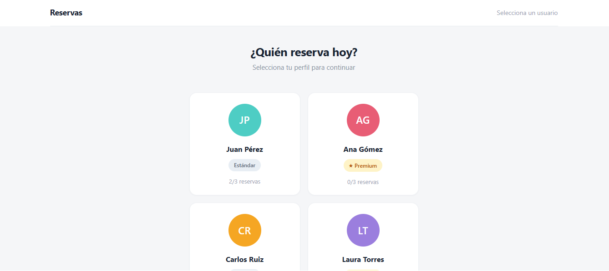
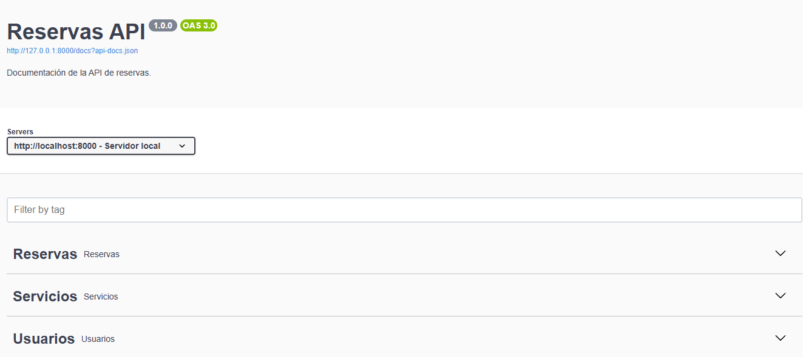

# 📌 PRUEBA TÉCNICA IA

Este proyecto incluye dos partes principales:

- **Frontend (React + TypeScript)**  
- **Backend (Laravel API)**  

El objetivo es ofrecer una solución completa de reservas con interfaz moderna y API robusta.

## 🚀 Requisitos previos

- Node.js >= 18  
- PHP >= 8.1  
- Composer  
- MySQL  

## ⚙️ Instalación

### 1. Clonar el repositorio
```bash
git clone https://github.com/odlanra2/prueba-tecnica-ia.git
cd prueba-tecnica-ia

cd reservas-api
composer install
cp .env.example .env
php artisan key:generate
php artisan migrate --seed
php artisan migrate:fresh --seed
php artisan serve

ir a documentacion Swagger
http://127.0.0.1:8000/api/documentation

## ⚙️ Configuración del archivo `.env`

El backend usa Laravel y requiere un archivo `.env` para definir las credenciales de la base de datos.  
Dentro de `reservas-api/.env` debes completar los siguientes parámetros:

```env
DB_CONNECTION=mysql
DB_HOST=127.0.0.1
DB_PORT=3306
DB_DATABASE=reservas_db
DB_USERNAME=root
DB_PASSWORD=

## 📦 Población inicial de datos

Este proyecto incluye un archivo `seed.json` con datos de prueba para usuarios, servicios y reservas.  
El archivo se encuentra en:
reservas-api/database/data/seed.json

cd ../frontend
npm install
npm start

🧪 Tests
Backend
php artisan test

### 🖥️ Frontend – Sistema de Reservas


### ⚙️ Backend – Documentación Swagger



# 📑 NOTAS DEL DESARROLLO

## 🔹 Decisiones de arquitectura

- **Laravel (Backend)**  
  Elegí Laravel porque es un framework rápido y sencillo de ejecutar, con una curva de aprendizaje baja y una comunidad muy activa.  
  Además, implementé **desacoplamiento con inyección de dependencias**, lo que facilita el mantenimiento y el manejo de pruebas unitarias.  
  Esto asegura que los servicios puedan probarse de manera aislada y que el código sea más limpio y escalable.

- **React (Frontend)**  
  Opté por React porque es una librería práctica y ampliamente usada en el ecosistema JavaScript.  
  También porque WordPress utiliza React para crear bloques Gutenberg, lo que conecta directamente con mi experiencia previa en WordPress.  
  Crear el frontend con React me permitió demostrar integración moderna y reutilización de conocimientos.

---

## 🔹 Uso de IA en el proyecto

- **Copilot en VS Code**  
  Partí de estructuras base que yo mismo diseñé (migraciones, controladores, componentes).  
  Copilot me ayudó a **completar código repetitivo**, aplicar **buenas prácticas** y generar ejemplos de **tests unitarios** y **documentación Swagger**.  
  Esto aceleró el desarrollo y me permitió enfocarme en la lógica de negocio.

- **Cursor (Agente de IA)**  
  Usé Cursor para mejorar la interfaz del frontend.  
  Partiendo de una interfaz básica creada por mí con **React + Bootstrap**, Cursor exploró mis archivos y me sugirió **estilos más elegantes y profesionales**.  
  Esto permitió que la aplicación tuviera una apariencia más cuidada sin perder mi control sobre la estructura.

---

## 🔹 Transparencia

- **Hecho por mí**:  
  - Diseño de la arquitectura (Laravel API + React frontend).  
  - Creación de migraciones, modelos y servicios.  
  - Configuración de seeders con archivo `seed.json`.  
  - Integración de frontend y backend en un solo repositorio.

- **Con ayuda de IA**:  
  - Generación de código repetitivo.  
  - Mejora de estilo y documentación.  
  - Sugerencias de pruebas unitarias y Swagger.  
  - Estilización avanzada del frontend.

---

## ✅ Conclusión

La combinación de **mi trabajo manual** y el **apoyo de IA** permitió entregar un proyecto sólido, documentado y con buenas prácticas.  
El objetivo fue mostrar transparencia en el uso de herramientas modernas sin dejar de demostrar mis propias habilidades técnicas.

